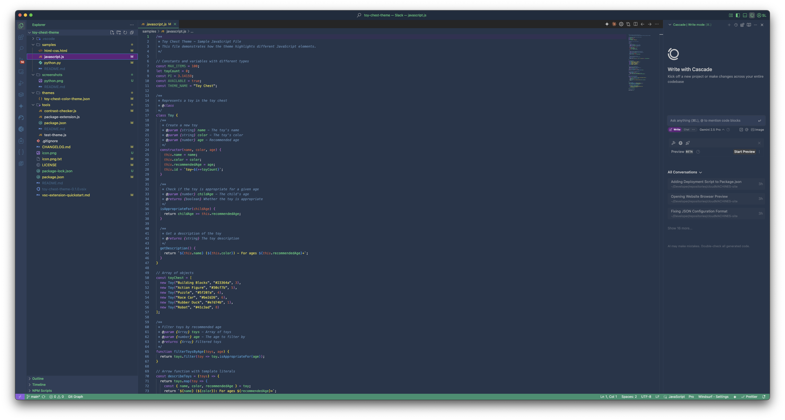
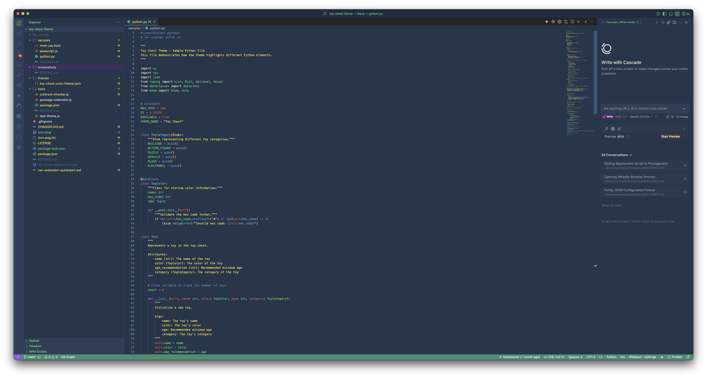
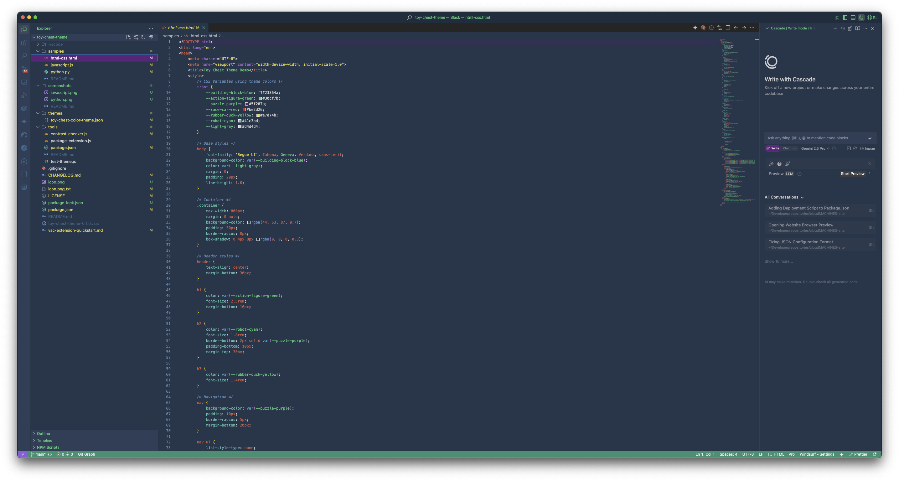

# Toy Chest Theme for VSCode/Cursor/Windsurf

I got tired of using solarized themes during the day so I converted a theme from the Kitty Terminal to a VSCode/Cursor/Windsurf theme.

## Features

- **Deep Navy Background**: A soothing #23364a background that's easy on the eyes
- **Bright Accents**: Playful highlights with #30cf7b green and other toy-inspired colors
- **Excellent Readability**: Carefully selected contrast ratios that meet WCAG AA standards
- **Terminal Colors**: Custom terminal color scheme that matches the theme
- **Optimized for Popular Extensions**: Works great with GitLens, Error Lens, and more

## Color Palette

The Toy Chest theme features a playful yet professional color palette inspired by childhood toys:

- **Building Block Blue** (#23364a): Deep navy blue background
- **Action Figure Green** (#30cf7b): Bright green for variables and highlights
- **Puzzle Piece Purple** (#5f207a): Royal purple for selections
- **Race Car Red** (#be2d26): Vibrant red for errors and warnings
- **Rubber Duck Yellow** (#e7d74b): Bright yellow for strings
- **Toy Robot Cyan** (#41c3ad): Bright cyan for types and classes

## Installation

1. Launch Visual Studio Code
2. Go to Extensions (or press `Ctrl+Shift+X`)
3. Search for "Toy Chest Theme"
4. Click Install
5. Open the Command Palette (`Ctrl+Shift+P`) and select "Preferences: Color Theme"
6. Select "Toy Chest"

## Manual Installation

If you prefer to install the extension manually:

1. Download the `.vsix` file from the [releases page](https://github.com/fakebizprez/toy-chest-theme/releases)
2. Open VS Code and go to Extensions
3. Click the "..." menu and select "Install from VSIX..."
4. Select the downloaded file

## For Cursor Editor Users

This theme is fully compatible with Cursor Editor. Install it the same way you would for VS Code.

## Screenshots

### JavaScript


### Python


### HTML/CSS


## Recommended Settings

For the best experience with Toy Chest Theme, consider these settings:

```json
{
  "editor.fontFamily": "'DepartureMono Nerd Font', 'monospace'",
  "editor.fontLigatures": true,
  "editor.bracketPairColorization.enabled": true,
  "editor.guides.bracketPairs": true
}
```

## Customization

If you want to customize certain aspects of the theme, you can override settings in your `settings.json` file:

```json
{
  "workbench.colorCustomizations": {
    "[Toy Chest]": {
      "editor.background": "#1e2f40", // slightly darker background
      "statusBar.background": "#30cf7b" // brighter status bar
    }
  }
}
```

## Development Tools

The `tools` directory contains several utilities to help develop and test the theme:

- **test-theme.js**: Launches VS Code with the theme for testing
- **package-extension.js**: Packages the theme for distribution
- **contrast-checker.js**: Verifies color contrast ratios for accessibility

To use these tools, you can run the npm scripts from the root directory:

```bash
# Test the theme in VS Code
npm run test

# Package the extension
npm run package

# Check contrast ratios
npm run check-contrast
```

Or use the tools directly:

```bash
node tools/test-theme.js
node tools/package-extension.js
node tools/contrast-checker.js
```

See the [tools README](tools/README.md) for more information.

## Contributing

Contributions are welcome! If you'd like to contribute, please:

1. Fork the repository
2. Create a feature branch
3. Make your changes
4. Submit a pull request

## License

This theme is released under the MIT License. See the [LICENSE](LICENSE) file for details.


